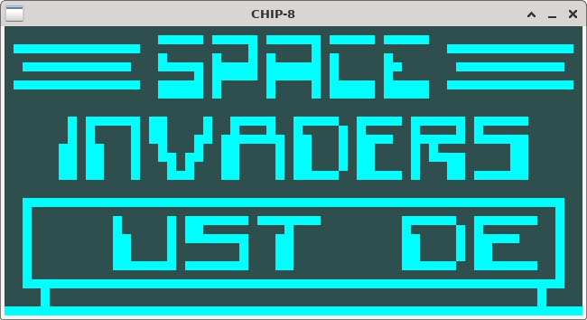
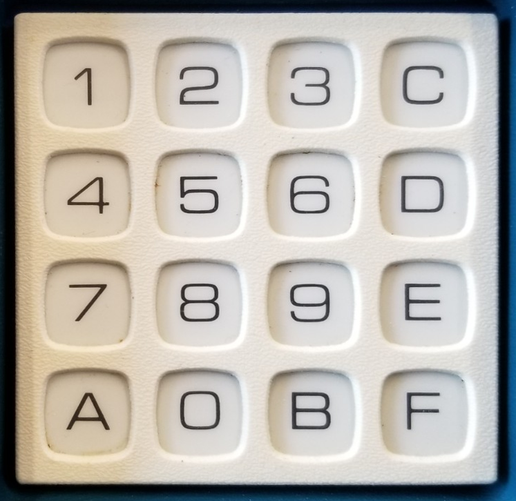

# chip8ml - CHIP-8 Emulator in OCaml

The CHIP-8 is a popular virtual machine originally developed by Joseph
Weisbecker in the mid 70's. It's been ported to early
microcontrollers, C64, and even in a Super Famicom cartriage.

### Key Mapping

| Key | CHIP-8 |
|-----|--------|
| 1   | 1      |
| 2   | 2      |
| 3   | 3      |
| 4   | C      |
| q   | 4      |
| w   | 5      |
| e   | 6      |
| r   | D      |
| a   | 7      |
| s   | 8      |
| d   | 9      |
| f   | E      |
| z   | A      |
| x   | 0      |
| c   | B      |
| v   | F      |

### Status

- Most opcodes work, see test roms
- Sound register works but needs actual sound hooked up
- SDL only, web at some point in the future

### References

- https://tobiasvl.github.io/blog/write-a-chip-8-emulator/
- https://github.com/Timendus/chip8-test-suite
- https://laurencescotford.com/chip-8-on-the-cosmac-vip-keyboard-input/
- https://chip-8.github.io/extensions/
